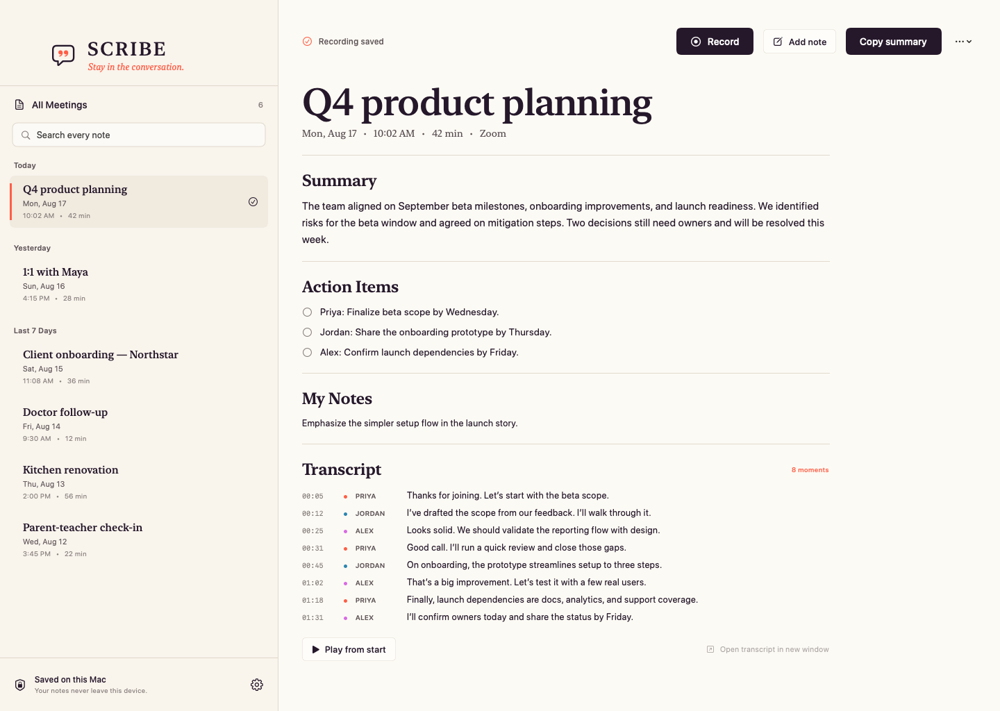

# Scribe

**Stay in the conversation.**

Scribe is a free, open-source, local-first meeting notes app for macOS. Choose
**Record** and it captures your microphone and the call app as separate tracks,
transcribes both sides on your Mac, and keeps the audio, transcript, summary,
actions, and your own notes together in plain files.



## Why Scribe

- **You decide when to record.** Scribe can notice a supported call and offer a
  Record / Not now prompt, but it never starts on its own.
- **Both sides are clear.** Your microphone and the selected call process are
  captured separately for dependable speaker labels.
- **Useful after the call.** Search every note, rename or trash meetings, copy a
  summary, check off action items, add personal context, play the recording, or
  export Markdown.
- **Ask with evidence.** Ask one meeting, a project, or the whole library and
  jump from timestamp citations to the recording. The default assistant runs
  locally; optional Venice, OpenAI, Claude, Grok, and compatible endpoints are
  invoked only after you connect them and press Ask.
- **Turn talk into follow-through.** Keep a decision log, group work by project
  and people, correct speaker names, and draft recap emails, status updates,
  agendas, or task lists without sending anything automatically.
- **Notes that fit the moment.** Choose concise, balanced, detailed, or
  action-focused summaries. Your quick notes guide the result, and saving an
  edit refreshes the summary. The built-in local fallback works with no setup.
- **Local means local.** No account, bot, telemetry, cloud transcript, hidden
  upload, subscription, or proprietary database.
- **Work and life fit together.** Product reviews, client calls, appointments,
  interviews, school check-ins, and personal projects live in one calm library.

## Supported calls

Scribe ships with capture profiles for:

- Zoom
- Microsoft Teams (new and classic)
- Google Meet in Chrome, Safari, Edge, and Firefox
- Slack huddles
- FaceTime
- Webex
- Discord

Scribe uses a non-global Core Audio process tap, so unrelated apps such as
Spotify are excluded. macOS isolates browser processes rather than individual
tabs; use a dedicated meeting window or profile when browser-tab isolation is
important.

## Download and install

Download `Scribe.dmg` from the repository's **Releases** page, open it, and drag
Scribe into Applications. The universal download supports both Apple silicon
and Intel Macs running macOS 15 or newer. The first recording asks for:

- Microphone access for your side
- Screen & System Audio Recording for the other side
- Calendar access only if you want automatic meeting titles

After installing 0.2 or newer, choose **Scribe → Check for Updates…** or
**Settings → Check now…**. Scribe verifies the signed update and installs it
over the existing copy; updates are never forced.

The release scripts support Apple Developer ID signing and notarization. Local
builds are ad-hoc signed; macOS may ask you to confirm opening one through
**System Settings → Privacy & Security**.

## Build it yourself

You need macOS 15+, Xcode 16+, and Swift 6.

```sh
git clone https://github.com/cmadd21mm/scribe.git
cd scribe
swift test
sh scripts/build-app.sh
open dist/Scribe.app
```

Create a drag-to-Applications installer:

```sh
sh scripts/package-dmg.sh
```

For a signed build, set `APPLE_SIGNING_IDENTITY`. To notarize the DMG, also set
`APPLE_NOTARY_PROFILE` to a configured `notarytool` keychain profile.

## Local transcription and summaries

Transcription uses FluidAudio's local Parakeet models. Settings offers English
(recommended), multilingual, and compact choices with explicit installed,
selected, and downloading states. Download one once from Scribe Settings, or
explicitly from Terminal:

```sh
scribe models download-transcription --model parakeet-v2
```

Normal recording and transcription make no network requests. Scribe always
creates a private structured note with a summary, decisions, action items, and
open questions. An optional locally installed `llama.cpp` executable and GGUF
model can make those notes richer; the built-in fallback requires no setup.

Ask Scribe also works locally with timestamped retrieval. Optional remote AI
connections use an API key stored in the Mac Keychain. Scribe can fetch the
text models available to that key from Venice AI, OpenAI, Claude, Grok/xAI, or
a custom OpenAI-compatible endpoint and presents them in a searchable picker;
manual model IDs remain available for private endpoints. Ordinary ChatGPT,
Claude, Grok, or Venice subscriptions may not include API access. Scribe sends
only the selected context after the user asks a question, redacts common
contact details by default, and sets `store: false` for OpenAI requests.

## Your files

The default folder is `~/Recordings`. Every conversation is an ordinary,
Obsidian-friendly folder:

```text
2026-08-17 1002 - Product planning/
├── mic.caf
├── system.caf
├── meta.json
├── transcript.json
├── transcript.md
├── note.md
├── user-notes.md
├── action-state.json
├── speaker-names.json
├── speaker-overrides.json
└── scribe-context.json
```

Incomplete recordings are recovered on the next launch. A free-space check runs
before capture, and metadata is written atomically as recording state changes.

## Configuration

Preferences are written to `~/.config/scribe/config.json`.

```json
{
  "recordings_dir": "~/Recordings",
  "prompt_for_calls": true,
  "call_prompt_delay_seconds": 8,
  "minimum_free_disk_gb": 2,
  "mic_voice_processing": false,
  "transcription": {
    "enabled": true,
    "engine": "parakeet",
    "model": "parakeet-v2"
  },
  "intelligence": {
    "provider": "local",
    "redact_sensitive": true
  }
}
```

Set `prompt_for_calls` to `false` if you want Scribe to wait quietly for you to
press Record. This setting never enables automatic recording.

## Command line

The app includes an optional CLI for automation and diagnostics:

```sh
scribe run
scribe start --bundle-id us.zoom.xos --title "Customer interview"
scribe stop
scribe apps
scribe doctor
scribe transcribe <meeting-folder>
scribe note <meeting-folder>
scribe recover
scribe models download-transcription --model parakeet-v2
```

Control commands use local distributed notifications and do not contact a
server.

## Contributing

Read [CONTRIBUTING.md](CONTRIBUTING.md), [PRIVACY.md](PRIVACY.md), and the
real-Mac [manual test checklist](MANUAL-TEST.md). CI runs the Swift test suite,
checks that runtime code has no network path beyond the explicit model command,
and builds a signed application artifact.

Scribe is MIT licensed. Recording laws and expectations differ by location and
context; always obtain the consent required for your conversation.
